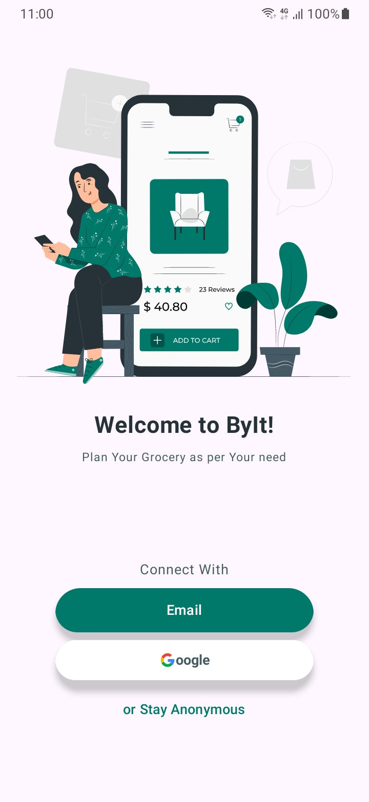
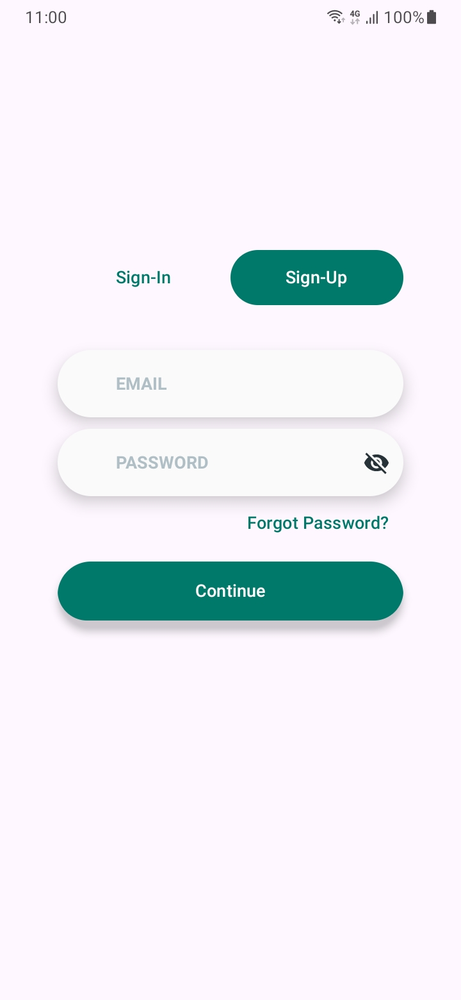
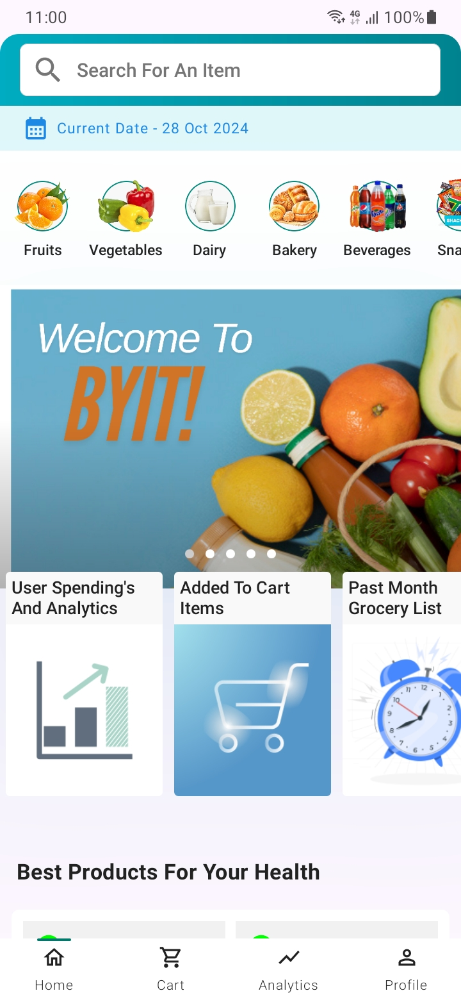
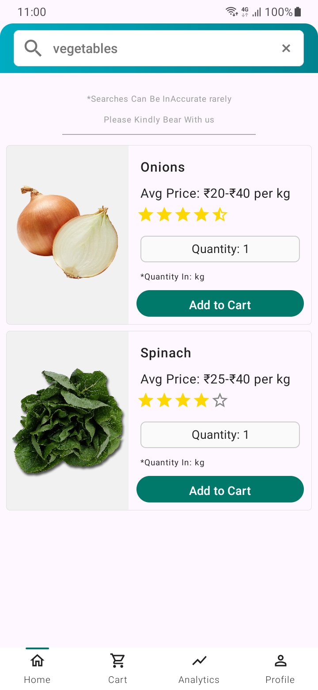
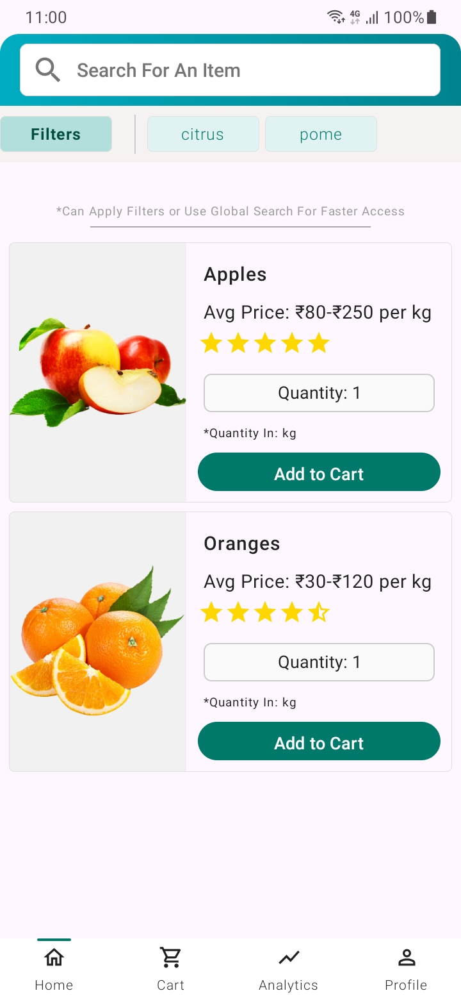
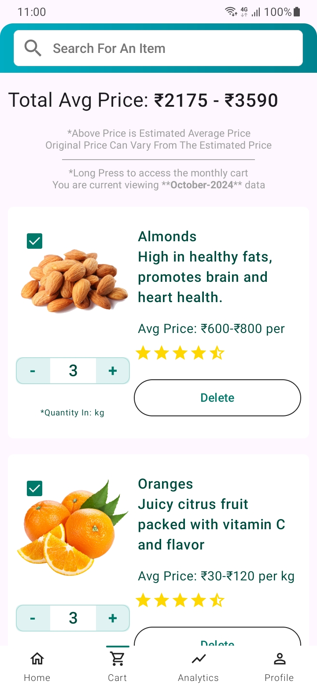
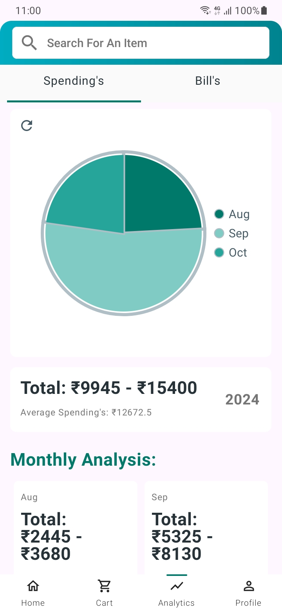
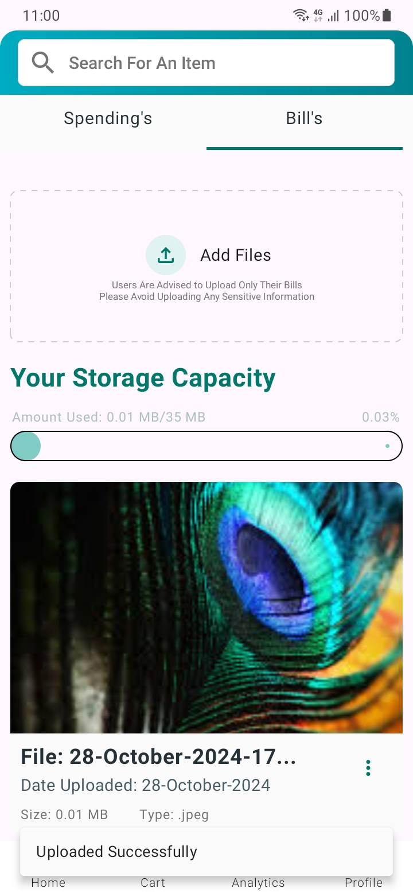
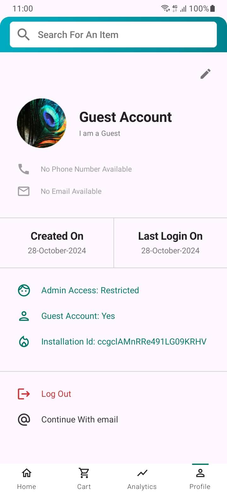

# 🛒 Byit! GroceryList App

**Byit!** is a feature-rich grocery list app designed to help users efficiently plan, manage, and analyze their monthly grocery expenses. From tracking spending trends to viewing purchase history and uploading bills, Byit! offers a complete solution to streamline your grocery shopping experience.

The **User App** is available now, and an **Admin App** with enhanced management capabilities is available, allowing grocery updates but not yet resolving customer issues.

## 📲 Project Overview

Byit! aims to help users make informed and budget-conscious shopping decisions with features that enable:
- Adding items to a monthly cart for grocery needs.
- Tracking monthly and yearly spending with detailed analytics.
- Viewing recommendations based on frequently bought items.
- Uploading bills for easy access (limited to 35MB for bill storage).
- Reviewing previous purchase records by month.

### App Roles
- **User:** Each user can manage only their data, including adding items to the cart, uploading bills, and viewing their analytics.
- **Admin:** Admins can update grocery details, add or remove items, and perform maintenance tasks within the app, but customer support is not yet available.
- **Owner:** The owner can add or remove admins, manage permissions, and has complete control over app functionalities.

--- 

## 📱 App Screenshots

### Portrait Mode Overview

<table align="center">
  <tr>
    <td align="center"><br /><strong>Welcome Screen</strong></td>
    <td align="center"><br /><strong>Login Screen</strong></td>
    <td align="center"><br /><strong>Home Screen</strong></td>
  </tr>
  <tr>
    <td align="center"><br /><strong>Search Screen</strong></td>
    <td align="center"><br /><strong>Categories Screen</strong></td>
    <td align="center"><br /><strong>Cart Screen</strong></td>
  </tr>
  <tr>
    <td align="center"><br /><strong>Analytics Overview</strong></td>
    <td align="center"><br /><strong>Spending Insights</strong></td>
    <td align="center"><br /><strong>User Profile</strong></td>
  </tr>
</table>

---

## 🚀 Features

### 1. User Account Options
   - **Signup & Login Options:** Users can register or log in using email, Google account, or choose a guest mode to explore the app.
   - **User Privacy:** Each user’s data is accessible only to them, ensuring privacy and security.

### 2. Home Screen and Recommendations
   - **Customized Recommendations:** The home screen provides tailored suggestions, including the most frequently purchased and health-focused products.
   - **Shortcut Access:** Quick links enable users to access categories and other important sections directly from the home screen.
   - **Categories and Filters:** Navigate through different product categories and use filters within categories for faster access to specific items.

### 3. Search Functionality
   - **Global Search Bar:** Easily search for products across all categories.
   - **Relevant Search Results:** Aids in quickly finding frequently bought or popular items among users.

### 4. Cart Management
   - **Add & Manage Items:** Users can add groceries to their cart, specifying quantities and editing items as needed.
   - **Previous Purchase Records:** Long-press in the cart screen to view items bought in previous months, organized by month for easy access.
   - **Delete & Update Cart Items:** Delete items or update the quantity based on monthly shopping requirements.

### 5. Analytics
   - **Yearly Spending Overview:** Analyzes user spending for each month, displaying the data in an easy-to-understand pie chart.
   - **Monthly Averages:** Provides average spending for the year to help users adjust their budgets.
   - **Total Spending Summary:** Gives a yearly total to offer an overall view of expenses for budget management.

### 6. Bill Storage
   - **Bill Upload:** Users can upload grocery bills to store for easy retrieval (limited to 35MB of storage).
   - **Privacy Notice:** Users are encouraged to upload only grocery-related bills and avoid sharing sensitive personal information.

### 7. Profile Management
   - **Editable Profile:** Users can update their profile details, including username, phone number, email, bio, and profile picture, ensuring the app reflects current information.

### 8. Navigation and Accessibility
   - **Bottom Navigation Bar:** Allows quick access to major screens, improving overall user experience.
   - **Responsive UI:** Designed for ease of use on various devices and screen sizes.

---

## 👨‍💼 Admin App Features

The Admin App enables:
- **Grocery Management:** Admins can add new items, update descriptions, or remove outdated items. (Limited to fewer than 100 items currently)
- **Reporting & Maintenance:** Admins can report app issues to the owner and perform app maintenance.

The **Owner** holds complete rights to add/remove admins and manage app configurations.

---

## ⚠️ Known Issues

- **Customer Support:** Customer support is not yet integrated within the Admin App.
- **Limited Groceries:** At present, the grocery list contains fewer than 100 items, but more will be added in future updates.
- **Performance Issues:** Some users may experience minor glitches or lags on certain devices, which we are actively working to optimize.

---
## 🛠️ Setup and Installation

1. **Clone the Repository**  
   ```bash
   git clone https://github.com/your-username/byit-grocerylist-app.git
   cd byit-grocerylist-app
   ```
   
 1. **Open in Android Studio**
	- Open the project in Android Studio.
	  
 3. **Install Dependencies**
	- **Build the Project**
    - Go to `Build` > `Rebuild Project`.
      
4.  **Run the App**
    - Connect an Android device or use an emulator.
    - Run the app by clicking the `Run` button or pressing `Shift + F10`.
      
5. **Output APK**
    - The output APK can be found at `outputs/apk/debug/app-debug.apk`. You can install this APK on your Android device to use the app.


---

## 🤝 Contribution Guidelines

We encourage contributions from the community! Here's how you can contribute to this project:

1. **Fork the Repository**  
    Click the `Fork` button at the top right of the repository page to create your own copy of the repository.
    
2. **Create a New Branch**  
    Create a new branch for your feature or bug fix:
    
    ```shell
    git checkout -b feature-name
    ```
    
3. **Make Your Changes**  
    Implement your changes and ensure that they align with the project's coding standards.
    
4. **Commit Your Changes**  
    Commit your changes with a descriptive message:
    
    ```shell
     git commit -m "Implemented feature X or fixed bug Y"
    ```
    
5. **Push Your Changes**  
    Push your branch to your repository:
    
    ```shell
     git push origin feature-name
    ```
    
6. **Submit a Pull Request**  
    Go to the original repository on GitHub and submit a pull request. Provide details about the changes you made.
    

## 📜 Attribution & License

- **Image Credits:** Thanks to [Freepik](https://www.freepik.com) and [SVGRepo](https://www.svgrepo.com) for some of the icons and images used in this app.
- **Disclaimer:** If any copyrighted images are used unintentionally, please inform us, and we will promptly remove them.
- **Open Source:** This app is open-source, and anyone is welcome to use, modify, or contribute to the codebase.


---

## 🌍 Future Updates

- **Customer Support Integration:** Enable admins to address user queries in the Admin App.
- **UI and Performance Improvements:** Aiming for a smoother, more responsive user interface with lag reduction.
- **Enhanced Security:** Implementing encryption to secure user data and ensure optimal data privacy.
- **Expanded Grocery Selection:** Adding more items to accommodate a broader range of grocery needs.
- **Increased Storage:** Enhancing the bill storage limit based on future requirements.

Byit! is dedicated to becoming the go-to app for grocery shopping, budgeting, and organization. We appreciate user feedback and aim to continually improve and expand our features!


---
## 📞 Contact Information

For any questions or support, please contact:

- **Name:** Sai Pavan Kiran
- **GitHub:** [SaiPavanKiran](https://github.com/SaiPavanKiran)
